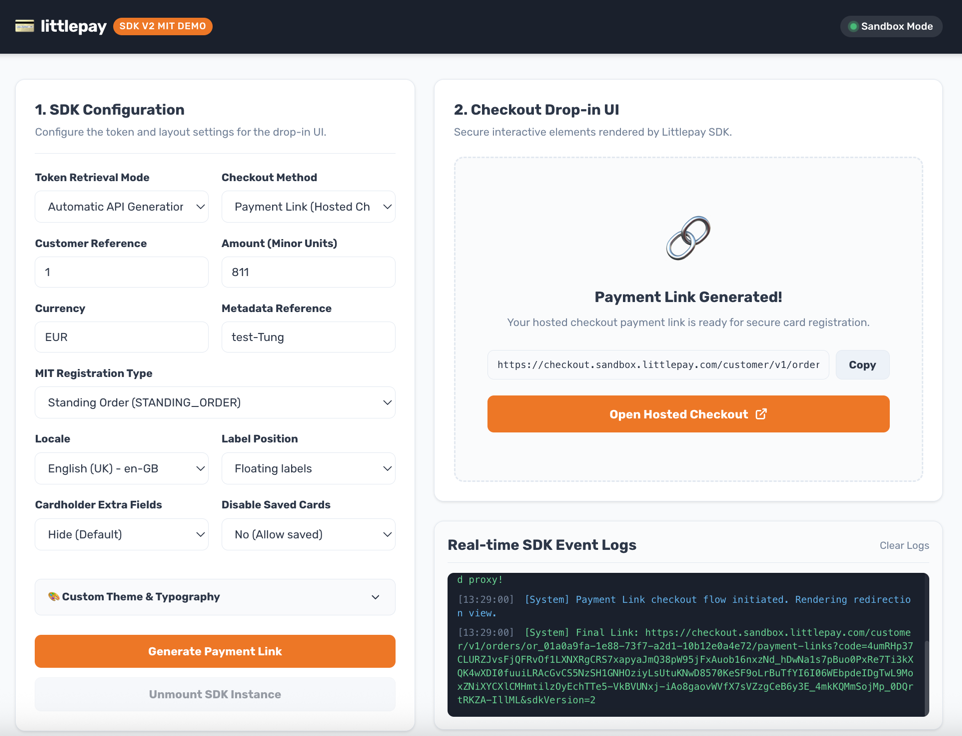

# Littlepay Checkout Sandbox Demo Playground (v2)

An interactive, high-fidelity engineering playground showcasing both **Inline JavaScript SDK (v2) Drop-in** and **Hosted Payment Link Redirection** card registration flows for Merchant-Initiated Transactions (MIT).

The application includes a zero-dependency local Node.js proxy server that reads sensitive API credentials securely from a **server-side configuration variable** (loaded from `env.local.json` which overrides `env.json`), bypassing browser CORS policies entirely while keeping your secret merchant key safe.


---

## 🚀 Key Features

- **Secure Server-Side API Key Management**:
  - The secret `X-Api-Key` is now configured and managed **exclusively on the server-side**.
  - No API keys are exposed to the browser client or written in client-side script files.
  - Automatically loads key parameters on startup natively from `env.local.json` (for local development, git-ignored) and falls back to `env.json` (the template with placeholders).
- **Dual-Mode Integration Showcase**:
  - **Inline SDK (v2)**: Mounts the secure card input form directly inside your page using the `LittlePay` library.
  - **Hosted Payment Link**: Automates the 4-step backend generation pipeline, automatically appending `sdkVersion=2`, and renders a redirection screen with copy-to-clipboard and a deep link CTA.
- **Automated Flow Orchestration**:
  - **Orders Endpoint**: `POST /merchant/v1/orders`
  - **Auto Capture**: `PATCH /merchant/v1/payment-intents/{id}` (sets capture method to `AUTO` for Payment Links)
  - **MIT Method Options**: `PUT /payment-intents/{id}/payment-method-options`
  - **Payment Links Generator**: `POST /orders/{order_id}/payment-links`
- **Dynamic Controls & Customizer**:
  - Customizable payload inputs (Customer Ref, Currency, Amount in minor units, Metadata Reference, and MIT Types).
  - Dynamic **Locale Selector** mapped directly to payment link payloads and SDK parameters (e.g. `en-GB`, `fr-FR`, `de-DE`, etc.).
  - Real-time **Theme Customizer** (color picker, border-radius, font-family selectors) with live synchronization.
- **Resilient Fallback Mode**:
  - Automatically activates **Simulation Mode** if offline or if CDN loading is blocked, serving a responsive simulated card layout with interactive validation so you can preview CSS changes seamlessly.
- **Developer logs Terminal**:
  - Intercepts all secure callbacks and API status responses (e.g., success, error, unmounts) and prints them with timestamps in a styled monospace container.

---

## 📁 File Structure

- `index.html`: Scaffolds the dual-column playground workspace, control variables, and secure mount wrappers.
- `style.css`: Modern styling incorporating custom monospace log consoles, glowing active state dots, animations, and responsive grids.
- `app.js`: Connects HTML state, registers color syncs, constructs config payloads, and intercepts success/error callbacks.
- `server.js`: Zero-dependency static files and backend proxy server. Reads `env.json` and overrides with `env.local.json` on startup.
- `env.json`: Template file committed to the repository containing placeholder values (e.g., `"LITTLEPAY_API_KEY": "FILLME"`).
- `env.local.json`: Local development secure override file (should be ignored in Git) containing your real secret API Key.

---

## 🛠️ How to Run & Test

1. **Configure Your Local Secure Override**:
   Create a file named `env.local.json` in the project root directory and paste your Sandbox API Key:
   ```json
   {
     "LITTLEPAY_API_KEY": "your_sandbox_key_here"
   }
   ```
   *Note: `env.json` should contain `"LITTLEPAY_API_KEY": "FILLME"`. This prevents committing secrets!*

2. **Start the Local Proxy Server**:
   In your terminal, run:
   ```bash
   node server.js
   ```
3. **Access the Playground**:
   Open your browser and navigate to:
   👉 **`http://localhost:8000`**

4. **Try Inline SDK Mode**:
   - Keep **Checkout Method** set to `Littlepay Drop-in SDK (Inline)`.
   - Choose your customization options and click **Generate Token & Register Card**.
   - Watch the SDK mount inline on the right column!

5. **Try Hosted Payment Link Mode**:
   - Change **Checkout Method** to `Payment Link (Hosted Checkout)`.
   - Click **Generate Payment Link**. The server-side proxy will run the secure 4-step backend generation pipeline using the server key, automatically appending `sdkVersion=2` and your selected dynamic locale.
   - Click the **"Open Hosted Checkout"** button to try the redirection checkout flow!
